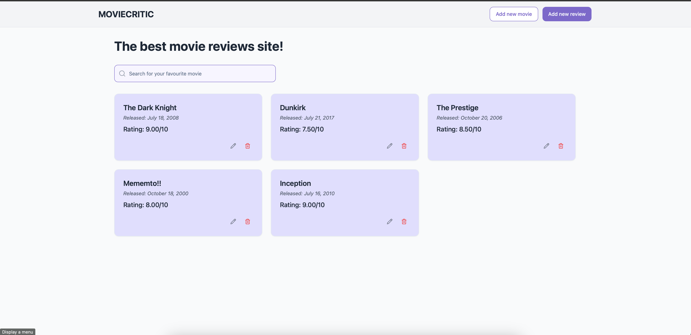

# Movie Critic

This project is a Movie Critic Website where users can browse movies and read reviews, as well as submit their own reviews and ratings. The website stores detailed information about each movie, including its name, release date, and average rating. Users can leave reviews for movies, including a rating (out of 10) and written comments.

## Demo

You can check out the live demo - https://movie-critic-opal.vercel.app/.


## Screenshots




## Installation

Install movie-critic backend server with npm

```bash
  cd server
  npm install
  npm run dev
```
    
## Deployment

To deploy this project run

```bash
  cd frontend
  npm run dev
```

## Features

### User Features
- **Browse Movies**: View detailed information about movies, including their name, release date, and average ratings.
- **Read Reviews**: Access user-generated reviews and comments for any movie.
- **Submit Reviews**: Users can write their own reviews and rate movies (out of 10).
- **Dynamic Average Rating**: The system updates the average rating for each movie automatically as new reviews are added.

### Database Features
- **PostgreSQL Database**: A robust schema is designed for efficient management of movies and user reviews.
- **Triggers**: Automatic recalculation of average ratings using database triggers upon submission of new reviews.

```
    CREATE OR REPLACE FUNCTION update_movie_average_rating()
    RETURNS TRIGGER AS $$
    BEGIN
        -- Calculate the new average rating for the movie
        UPDATE movies
        SET average_rating = (
            SELECT AVG(rating)
            FROM reviews
            WHERE movie_id = NEW.movie_id
        )
        WHERE id = NEW.movie_id;

        RETURN NEW;
    END;
    $$ LANGUAGE plpgsql;
```

```
CREATE TRIGGER update_average_rating_after_review
AFTER INSERT ON reviews
FOR EACH ROW
EXECUTE FUNCTION update_movie_average_rating();
```

- **Efficient Data Management**: Optimized schema for relational data management, ensuring quick data retrieval and updates.

### Development Features
- **Prisma ORM**: Integration with Prisma for simplified database operations.
- **Live Reloading**: Nodemon support for a smoother development experience.
- **Database Sync**: Automated database schema pull and code generation with Prisma.

### Scalability and Extensibility
- **Modular Design**: Well-structured codebase to support scalability and easier maintenance.
- **Custom Middleware**: Add or customize middleware for handling requests and responses.
- **CORS Support**: Enabled Cross-Origin Resource Sharing for seamless frontend-backend integration.

### Additional Features
- **RESTful API**: API endpoints for managing movies and reviews.
- **Responsive Design**: Frontend support for a responsive user experience.
- **Error Handling**: Comprehensive error-handling mechanisms for user-friendly feedback.

